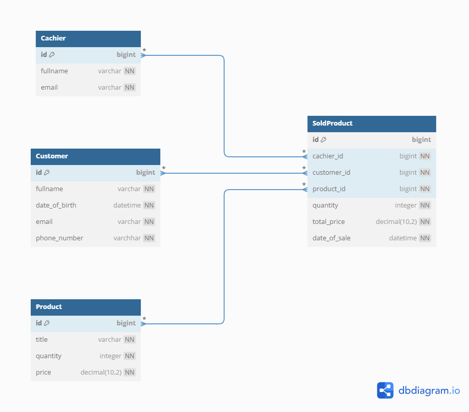

Schema is:

Tasks:

1. Добавить за один запрос 5 товаров
    - `tests.test_product_repository.test_save_many`

---

2. Получить список наиболее частых покупателей

Интерпретировал как:  
_Получить список покупателей с самым большим количеством купленных продуктов._  
_Длина списка определяется как входной параметр._  
_Покупатели с одинаковым количеством купленных продуктов должны быть отсоритрованы по
id_

- **Запрос**:
    - `src.repositories.customer_repository.CustomerRepository.get_most_frequent`
- **Тест**:
    - `tests.test_customer_repository.test_get_most_frequent`

---

3. Получить наименее частого покупателя

Интерпретировал как:  
_Получить покупателя с наименьшим количеством купленных продуктов._  
_Покупатели с одинаковым количеством купленных продуктов должны быть отсортированы по
id_

- **Запрос**
    - `src.repositories.customer_repository.CustomerRepository.get_least_frequent`
- **Тест**
    - `tests.test_customer_repository.test_get_least_frequent`

---

