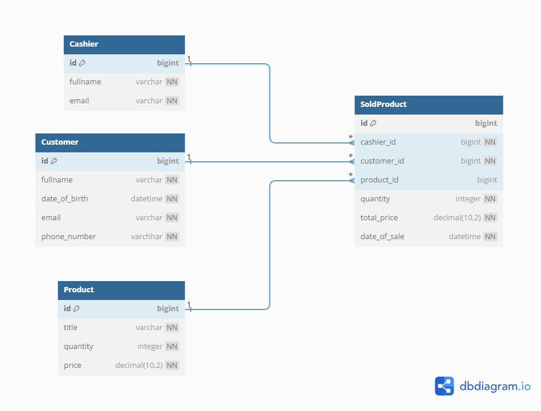

Schema is:

Tasks:

1. Добавить за один запрос 5 товаров
    - `tests.test_product_repository.test_save_many`

---

2. Получить список наиболее частых покупателей

Интерпретировал как:  
_Получить список покупателей с самым большим количеством купленных продуктов._  
_Длина списка определяется как входной параметр._  
_Покупатели с одинаковым количеством купленных продуктов должны быть отсоритрованы по
id_

- **Запрос**:
    - `src.repositories.customer_repository.CustomerRepository.get_most_frequent`
- **Тест**:
    - `tests.test_customer_repository.test_get_most_frequent`

---

3. Получить наименее частого покупателя

Интерпретировал как:  
_Получить покупателя с наименьшим количеством купленных продуктов._  
_Покупатели с одинаковым количеством купленных продуктов соритруются в порядке
возрастания их id_

- **Запрос**
    - `src.repositories.customer_repository.CustomerRepository.get_least_frequent`
- **Тест**
    - `tests.test_customer_repository.test_get_least_frequent`

---

4. Получить кассира который продал товары за последний месяц на наибольшую сумму.

- **Запрос**
    - `src.repositories.cashier_repository.CashierRepository.get_top_seller_last_month`
- **Тест**
    - `tests.test_cashier_repository.test_top_seller_last_month`

---

5. Получить самый продаваемый товар

- **Запрос**
    - `src.repositories.product_repository.ProductRepository.get_best_selling`
- **Тест**
    - `tests.test_product_repository.test_get_best_selling`

---

6. Получить самый дешевый и наиболее продаваемый товар

Интерпретировал как:  
_Получить самый дешевый товар из топ N самых продаваемых товаров._  
_Товары с одинаковым количеством продаж сортируются в порядке возрастания их id_

- **Запрос**
    - `src.repositories.product_repository.ProductRepository.get_cheapest_from_best_selling`
- **Тест**
    - `tests.test_product_repository.test_get_cheapest_from_best_selling`

---

7. Удалить наименее продаваемые товары

Интерпретировал как:
_Удалить топ N наименее продаваемых товаров._  
_Товары с одинаковым количеством продаж сортируются в порядке возрастания их id_  
_При удалении товара проставлять Null в таблицу SoldProduct_

- **Запрос**
    - `src.repositories.product_repository.ProductRepository.delete_least_sold`
- **Тест**
    - `tests.test_product_repository.test_delete_leas_sold`

---

8. Получить кассира, список товаров и покупателя, который единовременно приобрел товар
   на наибольшую сумму

Интерпретировал как:

1. _Получить покупателя, который единовременно совершил покупку на наибольшую сумму_
2. _Получить кассира, который провел эту сделку_
3. _Получить список товаров, которые брал этот покупатель за все время_

- **Use case**
  - `src.get_best_deal_context_use_case.GetBestDealContextUseCase.execute`
- **Тест**
  - `tests.test_get_best_deal_context_use_case.test_execute`